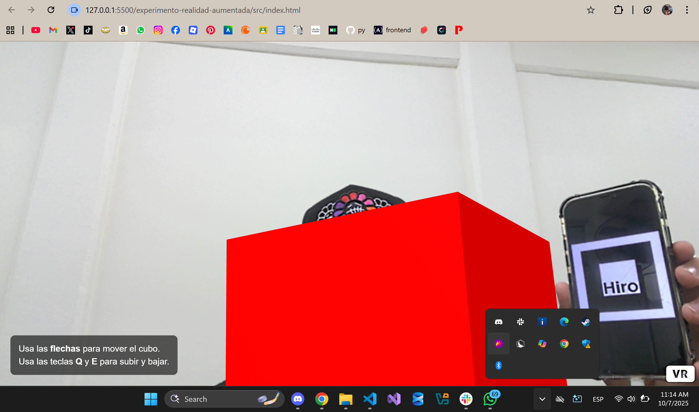
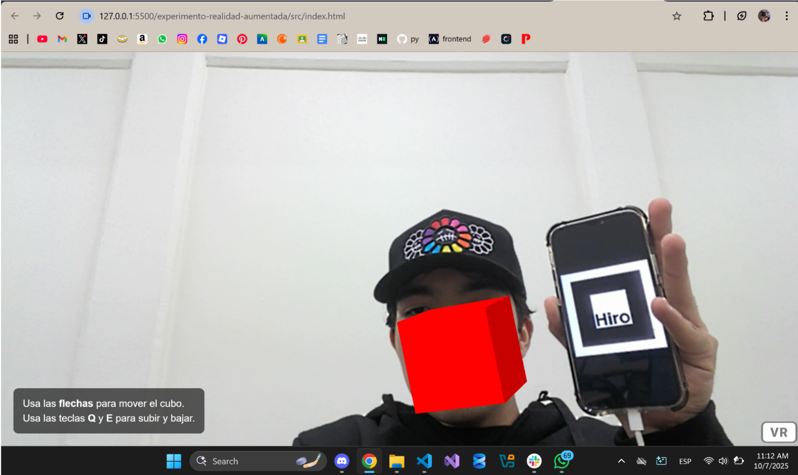

# Experimento con realidad aumentada
## Herramientas utilizadas
* **HTML:** En este archivo, está  toda la estructura principal de la página en la cual se realizó el experimento. Este HTML me sirvió para importar librerías las cuales son cruciales para indicar al navegador qué descargue A-Frame (para crear objetos 3D) y AR.js (para la Realidad Aumentada). 
En este mismo se utilizan etiquetas como `<a-scene>`, `<a-marker>`, y `<a-box>` las cuales son parte de A-Frame. Sirven para crear el mundo 3D y colocar el cubo rojo dentro de él. El `<a-marker>` sirve para decirle a AR.js qué imagen debe buscar.
* **CSS:** Este archivo me ayudó para darle un mejor aspecto a la apariencia visual del texto de las instrucciones para mover el cubo. El uso de este archivo fue corto ya que solo se utilizó para lo mencionado.
* **JavaScript:** Dentro de este archivo se lleva toda la lógica y la interactividad. Primero encuentra el cubo rojo en el HTML utilizado a tráves de `id="movable-cube"`. Después, este archivo se utiliza para esperar los `inputs` de las teclas con la función `addEventListener('keydown',...)`. Por último, se utiliza un switch para recibir los `inputs` de teclas que se utilizan para mover el cubo en la pantalla.
* **Realidad Aumentada:** La Realidad Aumentada es la que nos ayuda a conectar lo que ve nuestra cámara con el mundo virtual(el cubo rojo). Se utiliza el AR.js para poder utilizar la cámara de mi laptop. Una vez activa, la librería va a analizar mi cámara para buscar el patrón de imagen que se escribió el cual es `preset="hiro"`. Para esto, utilicé mi celular para mostrar la imágen de Hiro, la cual me ayudo a poder proyectar el cubo rojo.

## PantallaS

